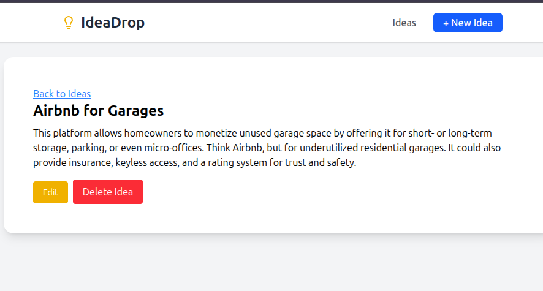

# 💡 Ideas App

A full-stack **MERN** project for sharing and exploring creative ideas.  
Built with **React (Vite)**, **Express**, **MongoDB**, **Node.js**, and **TanStack Query** for powerful data fetching and caching.

<!-- Image -->


---

## ⚙️ Tech Stack
**Frontend:** React, TanStack Query, Axios, React Router  
**Backend:** Node.js, Express, MongoDB, Mongoose  
**Tools:** Vite, dotenv, CORS  

---

## 🚀 Features
- Create, view, and manage ideas  
- RESTful API with MongoDB database  
- Real-time data sync via TanStack Query  
- Clean, modular codebase for scalability  

---

## 🧩 Setup
```bash
# Clone the repo
git clone https://github.com/tinegachris-o/ideas.git

# Install dependencies
cd server && npm install
cd ../client && npm install

# Run both servers
npm run dev
